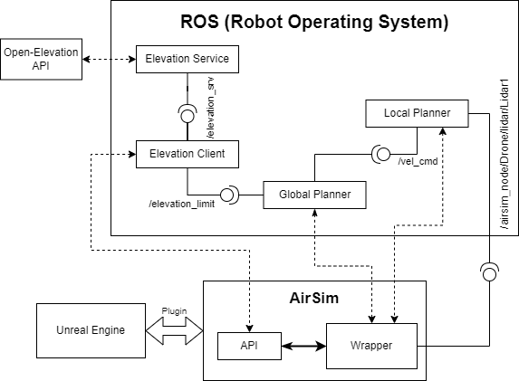

# Assignment 3 - Virtual Reality

Final assignment of the Virtual Reality course at the [University of Genova](https://unige.it/).

## Group members

| Name Surname | ID | Email address |
| ------------ | -- | ------------- |
| [Gabriele Nicchiarelli](https://github.com/gabri00) | S4822677 | S4822677@studenti.unige.it |
| [Alessio Mura](https://github.com/alemuraa)      | S4861320 | S4861320@studenti.unige.it |

#### Supervisors

- [Gianni Vercelli](https://rubrica.unige.it/personale/VUZCWVtr)
- [Saverio Iacono](https://rubrica.unige.it/personale/U0tGXV1h)

## Aim of the assignment

The project consists in the development of a "Smart UAV ambulance" with *ROS* and *Unreal Engine*. In this scenario we have a drone that is transporting a box of medicines (the payload) from a starting point to an ending point (the goal). If the drone isn't able to reach its goal because it hasn't enought battery autonomy, it proceeds to a charging station and then goes to the goal. The drone also has to respect the altitude limits provided by *D-Flight*.

Whit this assignment we demonstrate a simple, non optimal, drone navigation system for the transportation of payloads within the city of *Genova*.

## Requirements

- Unreal Engine 5.2
- Visual Studio 2022 (with Windows 10 SDK 10.0.19041 and latest .NET Framework SDK)
- Cesium plugin for Unreal
- Python 3.8
- WSL (with Ubuntu 20.04)
- ROS Noetic

#### Python requirements

```bash
pip install airsim msgpack-rpc-python # Airsim related
pip install geopandas shapely fiona requests numpy # Other packages
```

## Setup

#### Install Colosseum (on Windows)

To install and build Colosseum on Windows open the `Developer Command Prompt for VS 2022`:

```bash
git clone https://github.com/CodexLabsLLC/Colosseum.git
cd Colosseum
build.cmd
```

For more details follow the steps at this [link](https://microsoft.github.io/AirSim/build_windows/).

#### Setup the Unreal environment

Form the Unreal editor create a `new C++ class`, leave everything as default, then close Unreal and Visual Studio.
Copy `Unreal\Plugins` into your project's folder and add the following lines in your `<project_name>.uproject`:

```json
"Modules": [
    {
        "AdditionalDependencies": [
            "AirSim"
        ]
    }
]

"Plugins": [
    {
        "Name": "AirSim",
        "Enabled": true
    }
]
```

Also add this line to the `Config\DefaultGame.ini` file in your project's directory:

```bash
+MapsToCook=(FilePath="/AirSim/AirSimAssets")
```

Finally, right click the `.uproject` and select `Generate Visual Studio Project Files`.

Full tutorial at this [link](https://microsoft.github.io/AirSim/unreal_custenv/).

#### Launch the project

Open the `<prject_name>.sln`. In Visual Studio select "DebugGame editor" and "Win64" as build configuration.

Now you can run the project by pressing `F5`.

#### Set up Colosseum in WSL

We assume you have already installed *ROS Noetic*.
To install and build Colosseum, in your ROS workspace:

```bash
git clone https://github.com/CodexLabsLLC/Colosseum.git src/
cd src/Colosseum
./setup.sh
./build.sh
```

***Note***: you may need to delete the `ros2` folder in the Colosseum repository to avoid building problems.

Afterwards, build your workspace using `catkin_make`.

Full guide at this [link](https://microsoft.github.io/AirSim/airsim_ros_pkgs/).

#### Enable Airsim settings

To enable the Airsim settings copy the `settings.json` file in this repository in the folder `Documents/AirSim`.

```bash
cp settings.json <path_to_documents>/Documents/AirSim/settings.json
```

## Simulations

#### Launch the simulation

1. Open UE and start the game mode
2. Open a WSL terminal and launch: `roslaunch assignment_pkg assignment.launch`

***Note***: you may need to set up you ip and port. You can do it by setting them directly in the launch file or by launching the simulation with `host` and `port` as arguments. `roslaunch assignment_pkg assignment.launch`

#### Other configurations

In the launch file you can customize some parameters that will slightly change the simulation environment:
- `update_lidar_every_n_sec`: to change the update frequency of the lidar
- `weather`: to enable weather effects (see [allowed effects](https://microsoft.github.io/AirSim/apis/#weather-apis))
- `weather_value`: to set the turbulence level (from 0 to 1)

## Software Architecture



## Problems and solution adopted

- There is no proper API for getting the no-flight zones, thus we had to reconstruct a partial no-flight zone using *google earth* services.
- Due to the lack of information on the surrounding environment, Voxel maps couldn't be used to do a priori optimal planning, thus we decided to implement obstacle avoidance based on current lidar data.
- Due to the lack of computational power, we opted for a simple lidar based algorithm instead of more complex algorithms based on cameras and machine learning.

## Troubleshooting

Since AirSim is no more updated from 2022, all its dependencies should be based on a compatible version of Python. That is why you can NOT use `Python > 3.8`.
Eventually, consider to create a virtual environment with the correct Python version.

## References

- [Cesium for UE](https://cesium.com/learn/unreal/)
- [Colosseum](https://github.com/CodexLabsLLC/Colosseum)
- [AirSim documentation](https://microsoft.github.io/AirSim/)
- [D-Flight](https://www.d-flight.it/new_portal/)
- [ROS Noetic](https://wiki.ros.org/noetic)
- [Open-Elevation API](https://github.com/Jorl17/open-elevation/blob/master/docs/api.md)
- [Google Earth](https://www.google.com/intl/it/earth/about/)
